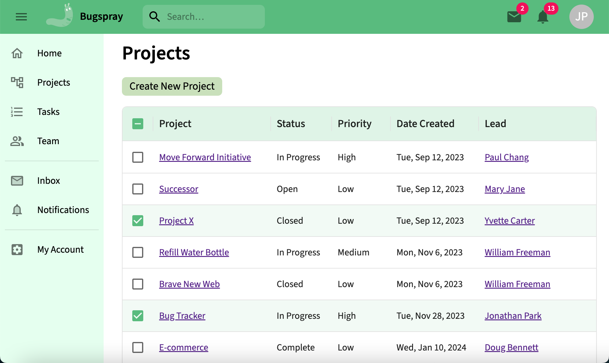

# Bugspray

**A full-stack bug-tracking application designed to streamline project management and enhance team collaboration through real-time Slack integration.**



---

## Table of Contents

- [Project Links](#project-links)
- [Overview](#overview)
- [Tech Stack](#tech-stack)
- [Features](#features)
- [System Architecture](#system-architecture)
- [Getting Started](#getting-started)
   - [Prerequisites](#prerequisites)
   - [Installation](#installation)
- [Future Enhancements](#future-enhancements)
- [Development Timeline](#development-timeline)

---

## Project Links

- **Live Application:** [bugspray.vercel.app](https://bugspray.vercel.app)
- **Repository:** [github.com/charquaza/bugspray](https://github.com/charquaza/bugspray)

---

## Overview

Bugspray is a comprehensive bug-tracking platform that facilitates efficient issue reporting, assignment, and resolution. Built with a focus on scalability and user experience, it integrates seamlessly with Slack to provide real-time notifications, ensuring that teams stay informed and responsive.

Built as the primary tool for managing my personal projects, I used Bugspray to track the development of my e-commerce platform, Pearlion, as well as the later stages of development for Bugspray itself.

Bugspray streamlines project management for both individuals and teams, and is currently being developed to support organization-scale multi-tenancy.

---

## Tech Stack

- **Frontend:** React, Next.js, CSS Modules, Material UI
- **Backend:** Node.js, Express.js
- **Database:** MongoDB (Mongoose ODM)
- **Authentication:** Passport.js, JSON Web Tokens (JWT), bcryptjs
- **DevOps:** Git, Docker, Google Cloud Run, Vercel, MongoDB Atlas
- **Integrations:** Slack API for real-time communication

---

## Features

- **Project Management:** Create, update, and track projects with detailed descriptions and statuses. Add tasks and assign them to sprints for better organization.
- **Team Collaboration:** Add team members to projects and assign them to tasks. Team members can communicate in real time on the dedicated project Slack channel.
- **Real-Time Slack Notifications:** Receive instant Slack messages upon any project-related updates, such as when new tasks are added.
- **Authentication and Authorization:** Secure login and registration using JWT and passwords hashed with bcrypt. Supports both broad role-based authorization and attribute-based authorization for granular control over access to sensitive data.
- **Responsive Design:** Optimized for various devices with accessible UI components.
- **Deployment:** Containerized backend deployed on Google Cloud Run, database on MongoDB Atlas, and frontend on Vercel.

---

## System Architecture

Bugspray employs a modular architecture following the MVC (Model-View-Controller) pattern:

- **Frontend:** Built with Next.js for server-side rendering and enhanced performance.
- **Backend:** Express.js handles RESTful API requests and business logic.
- **Database:** MongoDB stores user and project details.
- **Integration Layer:** Slack API is integrated to send real-time notifications to designated channels and users.
- **Deployment:** Docker containers ensure consistent environments; deployed via Google Cloud Run and Vercel.

---

## Getting Started

### Prerequisites

- Node.js v14 or higher
- MongoDB instance (local or Atlas)
- Slack workspace and API credentials

### Installation

1. **Clone the repository:**

   ```bash
   git clone https://github.com/charquaza/bugspray.git
   cd bugspray
   ```

2. **Install dependencies:**

   - **Backend:**
     ```bash
     cd server
     npm install
     ```

   - **Frontend:**
     ```bash
     cd ../client-next
     npm install
     ```

3. **Set up environment variables:**

   - For the backend, create a `.env` file in the `server` directory and add the following:

     ```env
     FRONTEND_DOMAIN=your_frontend_url
     MONGODB_URI=your_mongodb_connection_string
     JWT_SECRET=your_jwt_secret
     JWT_EXPIRES_IN=your_jwt_time_until_expiration
     SLACK_BOT_TOKEN=your_slackbot_token
     ```

   `FRONTEND_DOMAIN` will be `localhost` in development.  
   `MONGODB_URI` can be obtained by creating a database either locally or through MongoDB Atlas.  
   `SLACK_BOT_TOKEN` can be obtained by creating a Slack app ([learn more here](https://api.slack.com/tutorials/tracks/getting-a-token)).

   - For the frontend, create a `.env` file in the `client-next` directory and add:

     ```env
     NEXT_PUBLIC_API_URL=your_backend_url
     ```

   `NEXT_PUBLIC_API_URL` will be `localhost` in development.  

4. **Run the development servers:**

   - **Backend:**
     ```bash
     cd ../server
     npm run devstart
     ```

   - **Frontend (in a new terminal):**
     ```bash
     cd ../client-next
     npm run dev
     ```

   Both the frontend and backend will be available on `localhost` (ports may vary based on your configuration).

---

## Future Enhancements

- **Multi-tenancy:** Implement organization-level scoping such that each organization has isolated projects, team members, admins, and Slack workspace. Add super admin to manage organizations.
- **Visual Analytics:** Add visualizations for project progress, bug trends, and team performance.
- **Messaging and Notifications:** Build UI for sending and receiving Slack messages and notifications from Bugspray.

---

## Development Timeline

### 2025

- **Week 32 (Feb 24 - Mar 2):** Finish deployment (first Google Cloud for both frontend and backend, then Vercel for frontend). Add final touches to styling.  
   _Faced several deployment challenges, such as switching from sessions to JWT._

- **Week 31 (Feb 17 - Feb 23):** Research deployment options, Dockerize the app, and prep code for Google Cloud deployment.  

- **Week 30 (Feb 10 - Feb 16):** Connect remaining app features to Slack (members, tasks, sprints).  
   _Finished early and began researching deployment._

- **Week 29 (Feb 3 - Feb 9):** Connect Projects to Slack channels and implement message updates on project changes (frontend and backend).

- **Week 28 (Jan 27 - Feb 2):** Brainstorm third-party API integrations, research Slack API, and design integration plan.

- **Weeks 25–27 (Jan 5 - Jan 25):** Finalize styling, including details pages, create/update forms, data grids, and landing page.

- **Week 24 (Dec 29, 2024 - Jan 4, 2025):** Finalize production styling for responsiveness and mobile compatibility.

- **Feb 4, 2024 - Dec 28, 2024:** Start work on second project, Pearlion.  

### 2024

- **Week 23 (Jan 31 - Feb 6):** Improve UI integration of sprints and task interactions; focus on styling, especially customizing MUI Data tables.

- **Week 22 (Jan 24 - Jan 30):** Refactor code, extract components (task and sprint forms), and begin tracking development with Bugspray.

- **Jan 11 - Jan 23:** Unable to work due to illness and family health issues.

- **Week 21 (Jan 4 - Jan 10):** Implement sprints (model, controllers, routes) and add to UI.

- **2023 Dec 19 - 2024 Jan 4:** Take time off for holidays, plus mom's caretaker is on break.

### 2023

- **Week 20 (Dec 18 - Dec 24):** Create sprint model, routes, and controllers for API.  
   _Limited time due to mom's caretaker going on break._

- **Week 19 (Dec 11 - Dec 17):** Continue styling and frontend routing, implement 404 pages, standardize server responses, and improve error handling.

- **Week 18 (Dec 5 - Dec 11):** Restructure frontend layout for landing page and dashboard; continue planning sprints.  
   _Progress slowed due to illness and learning Next.js best practices._

- **Week 17 (Nov 27 - Dec 3):** Complete base styling for dashboard pages and add sprints to tasks.

- **Week 16 (Nov 20 - Nov 26):** Begin implementing sprints and plan styling for sign-up, log-in, and dashboard pages.  
   _Faced integration challenges with Next.js and Material UI._

- **Week 15 (Nov 13 - Nov 19):** Fine-tune delete cases and create forms; address edge case bugs.

- **Week 14 (Nov 6 - Nov 12):** Add project, user, and task create forms; implement member and task details pages (CRUD).

- **Week 13 (Oct 30 - Nov 5):** Implement project details page (get, update, delete, authorization, error handling).

- **Week 12 (Oct 23 - Oct 29):** Build sign-up form, add API authorization, and improve server error handling.  
   _Addressed unforeseen edge cases after connecting frontend and backend._

- **Week 11 (Oct 16 - Oct 22):** Set up CORS, cookies, user auth, and routes; connect backend to frontend.

- **Week 10 (Oct 9 - Oct 15):** Prepare for frontend-backend integration, set up authentication, Passport.js, sessions, and Next.js app skeleton.

- **Weeks 7–9 (Sep 18 - Oct 8):** Research frameworks, learn Next.js, and plan frontend-backend connection.  
   _Ready to start connecting frontend and backend, but found out that create-react-app is now deprecated, so started research into alternatives. Transitioned to NextJS (learning curve was steeper than anticipated)_

- **Week 6 (Sep 11 - Sep 17):** Add routes, complete memberController, project/task controllers, error handling, and database communication.

- **Week 5 (Sep 4 - Sep 10):** Create models and begin work on controllers.

- **Week 4 (Aug 28 - Sep 3):** Set up backend (nodemon, dotenv, MongoDB, Mongoose); shift to backend-first approach.

- **Week 3 (Aug 21 - Aug 27):** Regain code familiarity, add data tables to Projects and Team pages, and begin backend planning.

- **2021 Dec 7 - 2023 Aug 20:** _Pause development for family responsibilities; multiple family medical events in 2022._

### 2021

- **Week 2 (Nov 30 - Dec 6):** Build dashboard pages (projects, tasks), implement localStorage login (dev only), continue routing and layout work, add data table to Tasks page.

- **Week 1 (Nov 20 - Nov 26):** Research project scope and design, build frontend skeleton, routing, layout, and initial styling.